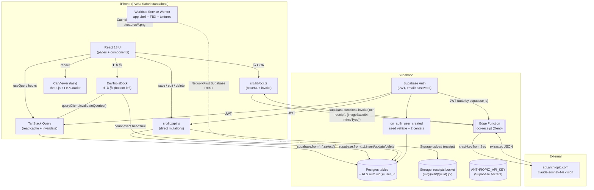
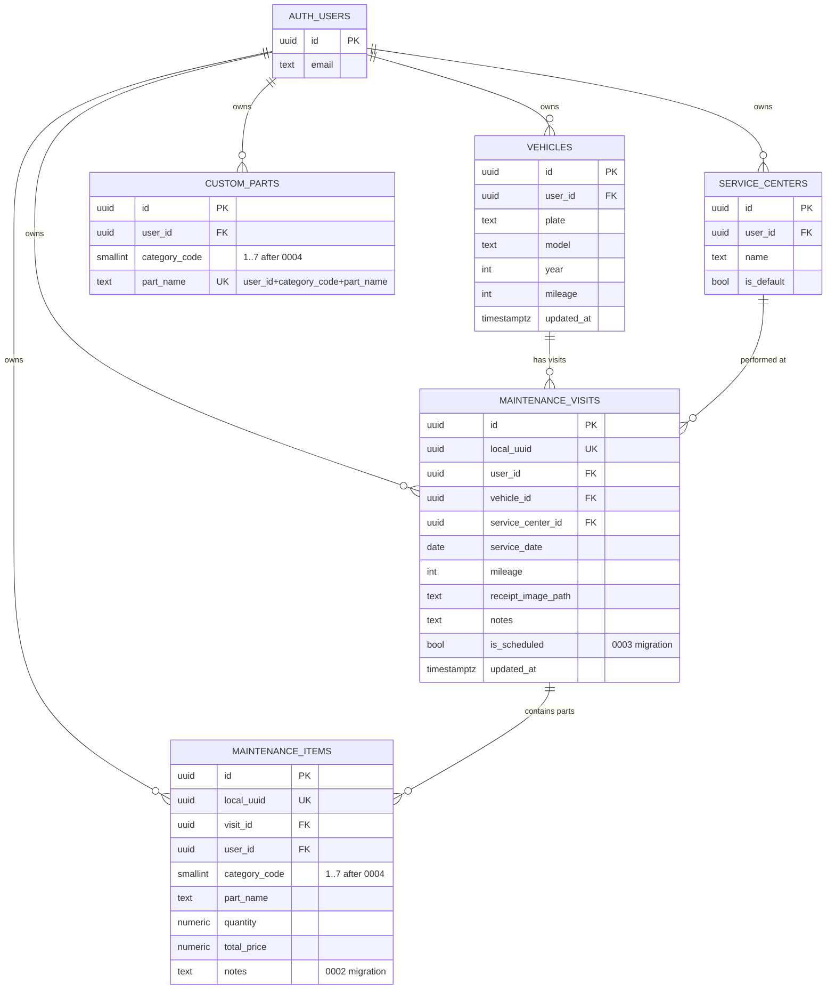
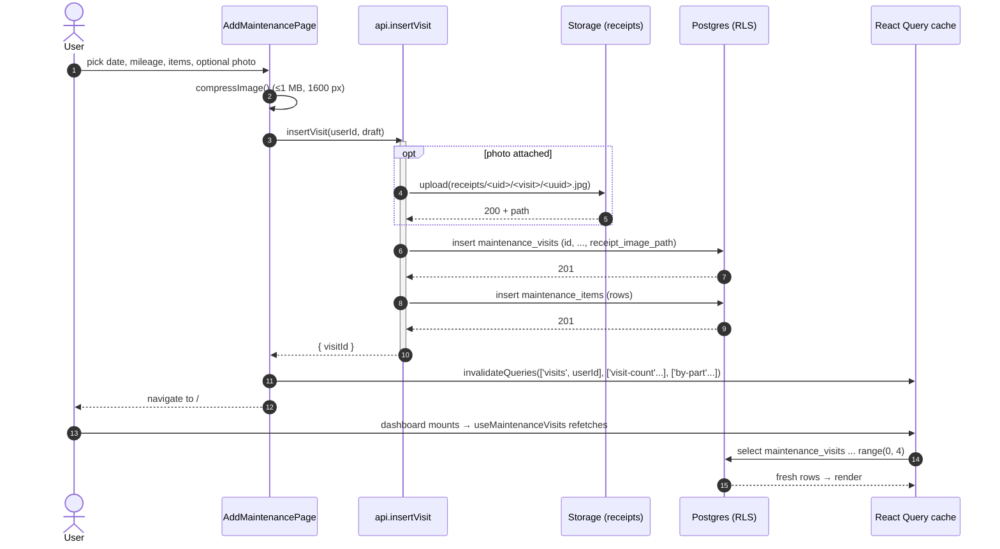
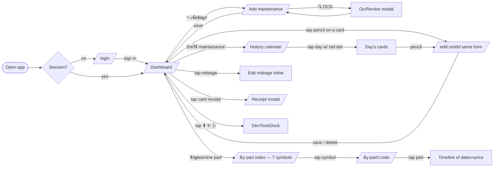
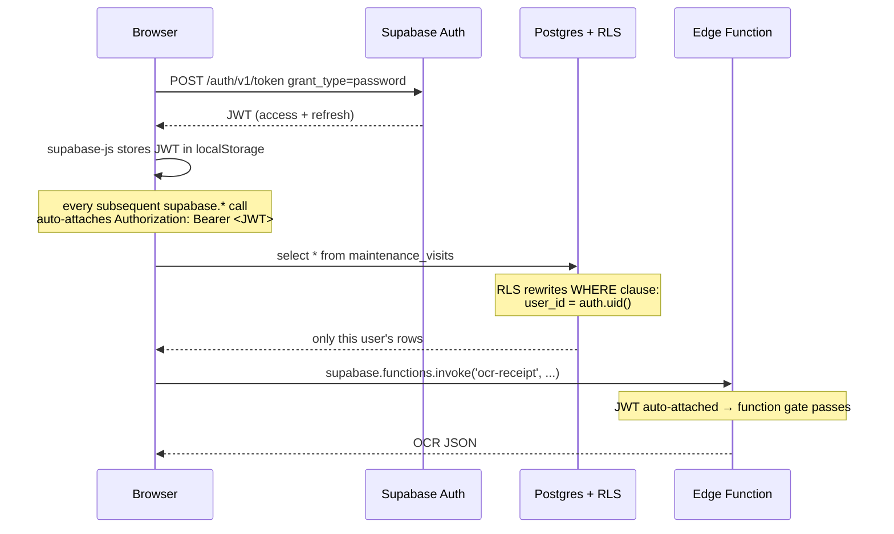

# CX-5 Maintenance — PWA

> Personal mobile-first web app (installable on iPhone via PWA) for tracking
> maintenance visits on a **Mazda CX-5 2016 ทะเบียน ขข4699**.
> Thai + English UI, dates in **พุทธศักราช (พ.ศ.)**, Supabase backend with
> row-level security per user, **server-direct architecture** (no local
> mirror), receipt **OCR via a Supabase Edge Function calling Claude vision**,
> and a small 3D viewer of the car on the dashboard.

---

## Table of contents

1. [Tech stack](#tech-stack)
2. [Architecture](#architecture)
3. [Data schema](#data-schema)
4. [Flow charts](#flow-charts)
5. [Project layout](#project-layout)
6. [Setup](#setup)
7. [Install on iPhone](#install-on-iphone)
8. [Verification](#verification)
9. [DevTools dock](#devtools-dock)
10. [Recent additions](#recent-additions)
11. [Open items](#open-items)

---

## Tech stack

| Concern | Choice | Why |
|---|---|---|
| Bundler | **Vite 5** | Best HMR, first-class PWA plugin |
| Framework | **React 18** | Stable pairing with `@react-three/fiber v8` and the wider ecosystem |
| Language | **TypeScript 5** strict | Fewer footguns; `noUnusedLocals` on |
| CSS | **Tailwind v3.4** | Stable; v4 ecosystem still fresh |
| Routing | **react-router-dom v6** | SPA routes + auth guard |
| Server data | **@supabase/supabase-js v2** + **@tanstack/react-query v5** | RQ caches every read; mutations in `src/lib/api.ts` call `supabase.from(...)` directly and `invalidateQueries` after |
| UI state | **Zustand v5** | History month, dashboard page, expanded-part set |
| 3D | **three v0.169** + **@react-three/fiber v8** + **@react-three/drei v9** | `useLoader(FBXLoader)`, `<ContactShadows />`, `<OrbitControls />` |
| Dates | **date-fns v4** + custom Thai/BE adapter (`src/lib/thai-date`) | No third-party BE locale; we write a tiny wrapper |
| Image upload | native `<input capture="environment">` + **browser-image-compression** | iOS-friendly; no react-dropzone needed for mobile |
| Receipt OCR | **Supabase Edge Function** → **Anthropic Claude `claude-sonnet-4-6` vision** | API key stays in Supabase secrets; browser never sees it |
| PWA | **vite-plugin-pwa v0.20** (Workbox, `autoUpdate`) | Auto manifest + SW + runtime caching |
| Tests | **Vitest v2** + `@testing-library/react` + `jsdom` | Same engine as Vite |

**Fonts (self-hosted)** — Inter Variable (Latin) + IBM Plex Sans Thai (Thai, `unicode-range U+0E00-0E7F`).

**Removed from earlier iterations** — Dexie + `dexie-react-hooks` + the whole `src/lib/sync/` offline-first stack (pending-mutations queue, flush loop, delta pull, dead-letters, schema probe, dedupe sweep). See [BUGS.md entry "dexie-sync-removed-radical-fix"](BUGS.md) for the why.

---

## Architecture

The app is a **client-only PWA** that talks straight to Supabase over HTTPS
using the user's JWT. There is no app server. All policy enforcement lives in
**Postgres RLS** (`auth.uid() = user_id` on every table).

There is **no offline mirror** — every read goes through a React Query hook
that hits `supabase.from(...).select()`, every mutation goes through
`src/lib/api.ts` and calls Supabase inline. After a mutation the caller
`invalidateQueries(['<key>'])` so the UI refetches. Connectivity is required.

The one server-side piece is a small Deno Edge Function
(`supabase/functions/ocr-receipt`) that proxies receipt images to Claude
vision so the Anthropic API key never reaches the browser.



**Key invariants:**

- **Single source of truth.** Every row lives only on the server. The
  React Query cache is a transient read accelerator with `staleTime`
  10–30 s per hook — drop it (⬆ button) and you immediately see canonical
  state on the next refetch.
- **RLS is the only ACL.** Even if the client were compromised, RLS prevents
  cross-user reads/writes.
- **No write queue, no replay.** A failed mutation throws to the caller
  and the form surfaces the error. No silent drift, no resurrected ghosts.
- **The Anthropic key never reaches the browser** — only the Edge
  Function holds it (`Deno.env.get("ANTHROPIC_API_KEY")` from Supabase
  secrets). `supabase.functions.invoke()` auto-attaches the user's JWT
  so the function is auth-gated by default.
- **The 3D viewer is `React.lazy`-loaded** so the login / non-dashboard
  routes don't pay the ~880 KB three.js cost.
- **FBX (6 MB) is excluded from precache** and loaded via runtime
  `CacheFirst` to keep the SW install under 5 MB.

---

## Data schema

5 user-scoped tables + 1 storage bucket. RLS policies on every table:
`select / insert / update / delete using (user_id = auth.uid()) with check (user_id = auth.uid())`.



`local_uuid` columns are vestigial from the offline-first era — kept for
schema compatibility with old rows. New inserts populate it with a fresh
UUID. We no longer rely on the `(user_id, local_uuid)` upsert idempotency
because every mutation is a single direct call now.

**Category codes** (extended past `Maintainance_pattern.txt` by migration 0004):

| Code | Title (Thai) | English |
|---|---|---|
| 1 | ของเหลวและสารหล่อลื่น | Fluids & Lubricants |
| 2 | ระบบไอดี ไอเสีย และไส้กรอง | Filters & Emission System |
| 3 | ระบบไฟและชิ้นส่วนเฉพาะเครื่องดีเซล | Diesel Engine & Electrical |
| 4 | ช่วงล่าง เบรก และยาง | Chassis, Brakes & Tires |
| 5 | ชิ้นส่วนสิ้นเปลือง | General Consumables |
| 6 | เครื่องยนต์ | Engine *(added by 0004)* |
| 7 | อื่นๆ | Others *(demoted from code 6 by 0004)* |

Defined in [`src/lib/categories.ts`](src/lib/categories.ts) with seed `partName`
options for each dropdown. User-added parts persist in `custom_parts` and merge
into the dropdown next time.

**New-user seed trigger** (`handle_new_user`, in
[`supabase/migrations/0001_init.sql`](supabase/migrations/0001_init.sql)) inserts
on `auth.users` insert:

- 1 × `vehicles` — `('ขข4699', 'Mazda CX-5', 2016, 0)`
- 2 × `service_centers` — `'Mazda จันทบุรี'` + `'Mazda ระยอง'`

**Storage bucket `receipts`** is private. Path:
`<auth.uid()>/<visit_id>/<uuid>.jpg`. Object-level RLS:
`(storage.foldername(name))[1] = auth.uid()::text`.

---

## Flow charts

### 1. Adding a maintenance record



### 2. Receipt OCR

```mermaid
sequenceDiagram
    autonumber
    actor U as User
    participant P as AddMaintenancePage
    participant O as ocrReceipt
    participant EF as Edge Function<br/>(ocr-receipt)
    participant AN as Anthropic API<br/>claude-sonnet-4-6
    participant R as OcrReview modal

    U->>P: attach receipt photo
    U->>P: tap 🔍 อ่านข้อมูลจากรูป (OCR)
    P->>O: ocrReceipt(blob)
    O->>O: FileReader → base64 (strip "data:...;base64,")
    O->>EF: supabase.functions.invoke('ocr-receipt', { imageBase64, mimeType })
    Note over EF: JWT auto-attached by supabase-js
    EF->>AN: POST /v1/messages<br/>image + Thai-aware prompt
    AN-->>EF: text content (strict JSON array)
    EF->>EF: strip ```json fences, JSON.parse, validate shape
    EF-->>O: { items: [{ partName, quantity, unitPrice }, ...] }
    O-->>P: OcrItem[]
    P->>R: open with items
    U->>R: edit fields, assign หมวด per row
    U->>R: tap "บันทึก N รายการ" (bottom-right)
    R-->>P: DraftItem[] (each carries categoryCode)
    P->>P: merge into rows[categoryCode]
    Note over U,P: user still has to tap the OUTER save bar<br/>to commit the visit
```

### 3. User journey



### 4. Auth + RLS



---

## Project layout

```
public/
  models/Mazda_HiPoly.fbx         3D model (runtime CacheFirst)
  textures/{lights,tire,tire_N}.png
  fonts/                          Inter Variable + IBM Plex Sans Thai (self-hosted)
  icons/                          PWA icons (192/512/maskable/apple-touch-180)
  icons/categories/cat-1..7.png   PNG buttons from /Button (compressed)
  favicon.svg

src/
  main.tsx, App.tsx, router.tsx, index.css, test-setup.ts

  types/
    db.ts                         Hand-written DB row types
    domain.ts                     UI-level types (DraftItem, DraftVisit, ...)

  lib/
    api.ts                        Direct-Supabase mutations
    ocr.ts                        supabase.functions.invoke('ocr-receipt')
    vat.ts                        VAT 7% helpers — vatOf, withVat, breakdown
    image.ts                      compressImage() (≤1 MB / 1600 px)
    categories.ts                 7 categories + seed parts
    supabase/{client,session}.ts  createClient + useSession hook
    thai-date/index.ts            BE conversion + formatters (+ 24 unit tests)

  three/
    CarViewer.tsx                 lazy-loaded; transparent Canvas, OrbitControls
    useCarModel.ts                FBX load + mesh-name → texture mapping
    inspect-fbx.md                Notes for one-time mesh-name confirmation

  hooks/
    useVehicle.ts                 React Query — current user's vehicle
    useMaintenanceVisits.ts       React Query — paginated + ranged + dateSet + count + single
    useByPart.ts                  React Query — grouped by part_name
    useCustomParts.ts             React Query — useServiceCenters + useCustomParts(code)
    useReceiptUrl.ts              Supabase Storage signed-URL cache
    useDriftStatus.ts             Polls (every 5 min) — RQ cache count vs server count

  store/ui.ts                     Zustand: historyMonth, dashboardPage, expandedParts

  pages/
    LoginPage.tsx                 Email + password, iOS "Add to Home Screen" hint
    DashboardPage.tsx             3-pill action row + 3D + mileage overlay + recent cards
    AddMaintenancePage.tsx        Shared form for /add AND /edit/:visitId + OCR trigger
    HistoryCalendarPage.tsx       Thai calendar w/ red dots + bottom monthly summary
    ByPartIndexPage.tsx           2×3 grid of category symbols (transparent, no labels)
    ByPartPage.tsx                Drill-in to category, tap part → timeline

  components/
    AppShell.tsx                  Brand-blue wrapper; mounts DevToolsDock
    AuthGuard.tsx                 Redirects to /login when session is null
    DevToolsDock.tsx              Bottom-left ⬆ ↻ 🩺 controls + drift red-dot
    OcrReview.tsx                 Modal: extracted items + category assignment + save
    MileageOverlay.tsx            Inline-editable mileage on the 3D viewer
    CategoryIcon.tsx               wrapper for public/icons/categories/cat-N.png
    MaintenanceCard.tsx           Visit card w/ pencil edit + เช็คระยะ pill + VAT
    MaintenanceCardList.tsx       Paginated card list
    ReceiptImageButton.tsx        Opens ReceiptModal
    ReceiptModal.tsx              Signed-URL image viewer
    ThaiDatePicker.tsx            Input + popover CalendarGrid
    CalendarGrid.tsx              Month grid w/ red dots + Thai weekday labels
    PartDropdown.tsx              Select existing part or "+ อื่นๆ" inline-add
    ServiceCenterDropdown.tsx     Same pattern for service centers
    CategorySection.tsx           Collapsible category w/ qty + unit + total + notes
    Spinner.tsx

supabase/
  functions/
    ocr-receipt/index.ts          Deno edge function → Anthropic Claude vision
  migrations/
    0001_init.sql                 Tables + RLS + new-user trigger + storage bucket
    0002_item_notes.sql           Adds maintenance_items.notes
    0003_visit_scheduled.sql      Adds maintenance_visits.is_scheduled
    0004_add_engine_category.sql  category 6 = เครื่องยนต์; renumber อื่นๆ → 7
```

---

## Setup

### 1. Install + env

```bash
npm install
cp .env.example .env.local         # fill in VITE_SUPABASE_URL + VITE_SUPABASE_ANON_KEY
```

### 2. Provision Supabase (schema + auth)

1. Create a project at https://supabase.com.
2. Copy the API URL + `anon` public key into `.env.local`.
3. Supabase dashboard → SQL editor → run migrations **in order**:
   - [`0001_init.sql`](supabase/migrations/0001_init.sql) — tables, RLS, seed trigger, storage bucket.
   - [`0002_item_notes.sql`](supabase/migrations/0002_item_notes.sql) — adds `maintenance_items.notes`.
   - [`0003_visit_scheduled.sql`](supabase/migrations/0003_visit_scheduled.sql) — adds `maintenance_visits.is_scheduled`.
   - [`0004_add_engine_category.sql`](supabase/migrations/0004_add_engine_category.sql) — category 6 = Engine, demotes Others to 7.
4. Authentication → Providers → enable **Email**.

Or via [Supabase CLI](https://supabase.com/docs/guides/cli):

```bash
supabase login
supabase link --project-ref YOUR_REF
supabase db push     # applies every file under supabase/migrations/ in order
```

### 3. Deploy the OCR edge function

```bash
# from the project root (cwd matters — CLI reads supabase/functions/ relative to it)
cd C:\path\to\Car_maintainance

# Set the Anthropic API key as a Supabase secret. NEVER commit it; NEVER paste
# it into a public chat. Rotate it immediately if exposed.
supabase secrets set ANTHROPIC_API_KEY=sk-ant-api03-...

# Deploy. JWT verification is on by default — only signed-in users can call it.
supabase functions deploy ocr-receipt
```

Verify:

```bash
supabase functions list      # ocr-receipt should appear
supabase secrets list        # ANTHROPIC_API_KEY name should be present (value hidden)
```

If you skip this step, the 🔍 OCR button on `/add` will return an error
toast — every other surface still works.

### 4. Dev / build

```bash
npm run dev           # http://localhost:5173
npm run build         # production bundle in dist/
npm run preview       # serve dist locally
npm test              # vitest unit tests (24 thai-date tests)
npm run typecheck     # tsc --noEmit
```

---

## Install on iPhone

1. Deploy `dist/` to any static host (Vercel, Netlify, Cloudflare Pages…).
2. iPhone → open the URL in **Safari** (Chrome can't install PWAs on iOS).
3. Tap **Share** → **เพิ่มลงหน้าจอหลัก** ("Add to Home Screen").
4. Launch the icon → opens standalone, translucent navy status bar.

The first launch downloads the 6 MB FBX into the Workbox `fbx-models` cache;
subsequent launches load it offline.

---

## Verification

### Local end-to-end

1. `npm run dev`; sign up at `/login`.
2. Confirm the `handle_new_user` trigger seeded a vehicle + 2 service centers
   (check Supabase Studio).
3. Add a visit dated today — every visible date should render as พ.ศ.
4. **Reads refresh after mutation.** After save the dashboard list shows
   the new card immediately (`invalidateQueries` triggers refetch).
5. **Offline behaviour.** Toggle DevTools → Network → Offline. Try to
   save — the form surfaces a network error. No silent queue, no
   pending state.
6. **OCR.** Attach a receipt → tap 🔍. If the function is deployed
   with a valid key, a review modal opens with extracted rows.

### Unit tests

```
npm test
✓ src/lib/thai-date/index.test.ts (24 tests)
  - BE conversion (toBE / fromBE; Date + number overload)
  - all 8 formatters (short, shortMonth, medium, formatThaiDate alias,
    formatThaiDateLong, long, BE year, monthYear)
  - leap year (29 ก.พ. 2567), 1 ม.ค., 31 ธ.ค.
  - Thai numerals (๐-๙)
  - weekdays (อา. / อาทิตย์)
  - ISO date round-trips
  - buildCalendarGrid (always 42 cells; 30-day June, 29-day Feb 2024)
  - dayKey YYYY-MM-DD; THAI_WEEKDAYS shape
```

### RLS cross-check

With two test users A and B, sign in as B and attempt:

```sql
insert into maintenance_visits (user_id, vehicle_id, service_date, mileage, ...)
values (<A.id>, ..., '2026-06-03', 12345);
```

This must fail with a policy violation. Symmetric `select` returns only the
caller's rows.

### Lighthouse PWA audit

Run Chrome DevTools → Lighthouse → PWA. Target ≥ 90.

---

## DevTools dock

Three floating controls at the bottom-left of every authenticated screen.
The dock is **server-direct** — it pokes React Query and the service
worker, not a Dexie queue (the previous offline-first dock relied on a
write queue + dead-letter table that have both been removed).

| Icon | Function | Behaviour |
|---|---|---|
| ⬆ | **force-resync** | `queryClient.invalidateQueries()` drops every cached query, the active hooks refetch from Supabase. Toast reports the number of touched queries. |
| ↻ | **reload app version** | `swReg.update()` → `postMessage('SKIP_WAITING')` if a worker is `waiting` → `location.reload()`. Workbox runtime caches (FBX, textures, fonts, `supabase-rest` GET cache) survive so the 6 MB FBX isn't re-fetched. |
| 🩺 | **drift check** | Fetches `count: 'exact', head: true` for `maintenance_visits` and `maintenance_items` of the current user, compares against React Query cache counts (`['visit-count', uid]` + sum of cached `['visits', uid]` pages). Red dot on the button when local ≠ server. Auto-polls every 5 minutes via `useDriftStatus`. |

VAT 7% (`src/lib/vat.ts`) is a **display-only transform**. The DB still
stores `total_price` as the pre-VAT row total; every card / form sticky
bar / monthly summary pipes the same `breakdown(subtotal)` so the three
numbers (subtotal / VAT / grand total) stay consistent everywhere.

---

## Recent additions

- **Receipt OCR via Claude vision** — Edge Function `ocr-receipt` extracts items
  from receipt photos; `OcrReview` modal lets the user assign categories per
  row before merging into the Add form.
- **Server-direct refactor** — removed `src/lib/sync/*`, Dexie, dead-letters
  and the queue. Reads are React Query → Supabase, mutations are
  `src/lib/api.ts` → Supabase, then `invalidateQueries`. See
  [BUGS.md "dexie-sync-removed-radical-fix"](BUGS.md).
- **DevToolsDock back** — ⬆ ↻ 🩺 buttons re-wired for the server-direct
  world (no queue to flush, drift compares cache vs server counts).
- **VAT 7%** breakdown on every `MaintenanceCard`, the Add form's sticky save
  bar, and the bottom-of-history monthly summary card.
- **เช็คระยะ checkbox** below ศูนย์บริการ on the Add form; shows as a brand-tint
  pill next to the date on cards.
- **Monthly summary** card on `/history` — visit count + subtotal + VAT + grand
  total for the displayed month.
- **Editable visits** — pencil button on every `MaintenanceCard` → `/edit/:visitId`.
- **Per-item and visit-level notes** wired end-to-end (migrations 0002).
- **Three-pill dashboard** — `+ เพิ่มข้อมูล`, `ข้อมูลแยกตาม part`, `ประวัติ`.
- **/by-part index** — 2 cols × 3 rows of big transparent symbols, no labels.
- **PNG category icons** — `public/icons/categories/cat-{1..7}.png` (10–56 KB each).
- **3D viewer reverted to FBX-default colours**; `useCarModel` body slot is a
  no-op so the source material shows through.
- **Card shadows = none** — `shadow-card` / `shadow-soft` tokens intentionally empty.

---

## Open items

1. **No offline support.** A user on the subway can't save. If this becomes
   painful we'd consider a write-only queue (not a full mirror) — but only
   after a real repro of the duplication path that killed the Dexie layer.
2. **FBX mesh-name mapping** — texture substring rules in
   [`useCarModel.ts`](src/three/useCarModel.ts) (`/tire|wheel/`, `/light|lamp/`,
   etc.) need one-time confirmation against the actual mesh names of the
   shipped FBX. See [`src/three/inspect-fbx.md`](src/three/inspect-fbx.md).
3. **Universal Sans license** — using Inter + IBM Plex Sans Thai as a free
   substitute. To switch to a licensed Universal Sans build, replace the woff2
   files in `public/fonts/` and update the `@font-face` family names in
   [`src/index.css`](src/index.css).
4. **`gh` CLI not installed** — raw `git push` only.
5. **Migrations 0001–0004 must all be applied** to the live Supabase project,
   and `ocr-receipt` must be deployed with `ANTHROPIC_API_KEY` set, before
   first user use.
6. **Edge Function costs.** Each receipt OCR is one Anthropic API call
   (`claude-sonnet-4-6` vision). Keep an eye on quota on the Anthropic
   console if the app gets shared with more than one user.
