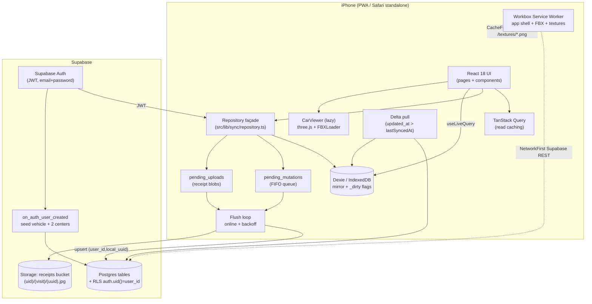
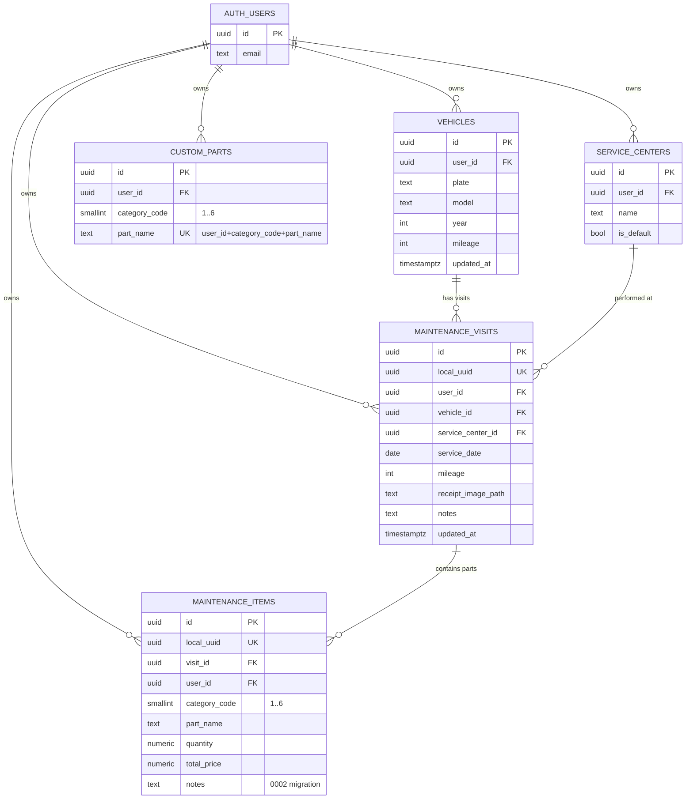
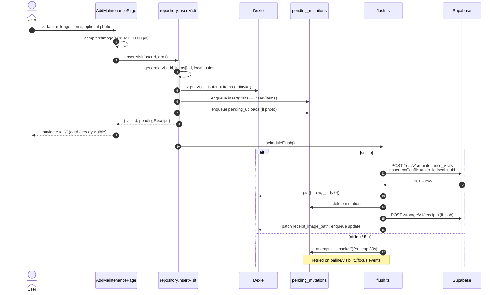
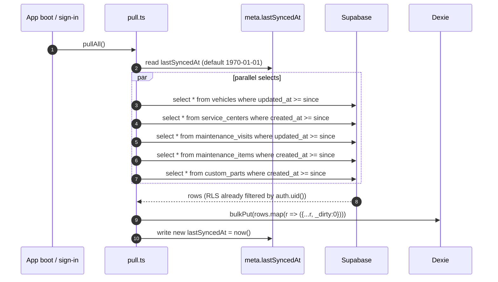
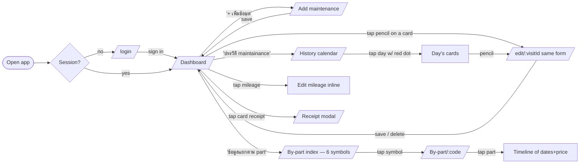
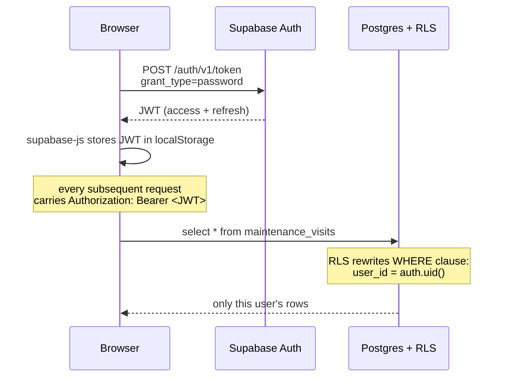

# CX-5 Maintenance — PWA

> Personal mobile-first web app (installable on iPhone via PWA) for tracking
> maintenance visits on a **Mazda CX-5 2016 ทะเบียน ขข4699**.
> Thai + English UI, dates in **พุทธศักราช (พ.ศ.)**, Supabase backend with
> row-level security per user, and a full offline-first sync queue.

---

## Table of contents

1. [Tech stack](#tech-stack)
2. [Architecture](#architecture)
3. [Data schema](#data-schema)
4. [Flow charts](#flow-charts)
5. [Project layout](#project-layout)
6. [Setup](#setup)
7. [Install on iPhone](#install-on-iphone)
8. [Verification](#verification)
9. [Open items](#open-items)

---

## Tech stack

| Concern | Choice | Why |
|---|---|---|
| Bundler | **Vite 5** | Best HMR, first-class PWA plugin |
| Framework | **React 18** | Stable pairing with `@react-three/fiber v8` and the wider ecosystem |
| Language | **TypeScript 5** strict | Fewer footguns; `noUnusedLocals` on |
| CSS | **Tailwind v3.4** | Stable; v4 ecosystem still fresh |
| Routing | **react-router-dom v6** | SPA routes + auth guard |
| Server data | **@supabase/supabase-js v2** + **@tanstack/react-query v5** | RQ caches reads; mutations go through `repository.ts` |
| Offline cache | **Dexie v4** + `dexie-react-hooks` | Local mirror of every row, `useLiveQuery` for reads |
| UI state | **Zustand v5** | History month, dashboard page, expanded-part set |
| 3D | **three v0.169** + **@react-three/fiber v8** + **@react-three/drei v9** | `useLoader(FBXLoader)`, `<ContactShadows />`, `<OrbitControls />` |
| Forms | **react-hook-form v7** + **zod v3** | Set up but kept light — `useState` is enough for the small Add form |
| Dates | **date-fns v4** + custom Thai/BE adapter (`src/lib/thai-date`) | No third-party BE locale; we write a tiny wrapper |
| Image upload | native `<input capture="environment">` + **browser-image-compression** | iOS-friendly; no react-dropzone needed for mobile |
| PWA | **vite-plugin-pwa v0.20** (Workbox, `autoUpdate`) | Auto manifest + SW + runtime caching |
| Tests | **Vitest v2** + `@testing-library/react` + `jsdom` | Same engine as Vite |

**Fonts (self-hosted)** — Inter Variable (Latin) + IBM Plex Sans Thai (Thai, `unicode-range U+0E00-0E7F`). Substitute for Universal Sans; swap the woff2 files later if a licensed Universal Sans build arrives.

---

## Architecture

The app is a **client-only PWA** that talks directly to Supabase over HTTPS using
the user's JWT. There is no app server. All policy enforcement lives in
**Postgres RLS** (`auth.uid() = user_id` on every table). Offline correctness
comes from a **write-through repository** that writes Dexie first, queues a
mutation, then drains the queue against Supabase with idempotent upserts.



**Key invariants:**

- **Mutations never block on network.** UI sees the new row the moment the Dexie
  transaction commits. The flush loop drains the queue asynchronously.
- **Idempotency** via `(user_id, local_uuid)` unique constraints on the two
  high-volume tables (`maintenance_visits`, `maintenance_items`). Replays are
  safe.
- **RLS is the only ACL.** Even if the client were compromised, RLS prevents
  cross-user reads/writes.
- **The 3D viewer is `React.lazy`-loaded** so the login / non-dashboard routes
  don't pay the ~880 KB three.js cost.
- **FBX (6 MB) is excluded from precache** and loaded via runtime `CacheFirst`
  to keep the SW install under 5 MB.

---

## Data schema

5 user-scoped tables + 1 storage bucket. RLS policies on every table:
`select / insert / update / delete using (user_id = auth.uid()) with check (user_id = auth.uid())`.



**Category codes** (per `Maintainance_pattern.txt`):

| Code | Title (Thai) | English |
|---|---|---|
| 1 | ของเหลวและสารหล่อลื่น | Fluids & Lubricants |
| 2 | ระบบไอดี ไอเสีย และไส้กรอง | Filters & Emission System |
| 3 | ระบบไฟและชิ้นส่วนเฉพาะเครื่องยนต์ดีเซล | Engine & Electrical |
| 4 | ช่วงล่าง เบรก และยาง | Chassis, Brakes & Tires |
| 5 | ชิ้นส่วนสิ้นเปลือง | General Consumables |
| 6 | อื่นๆ | Others |

Defined in [`src/lib/categories.ts`](src/lib/categories.ts) with seed `partName`
options for each dropdown. User-added parts persist in `custom_parts` and merge
into the dropdown next time.

**New-user seed trigger** (`handle_new_user`, in
[`supabase/migrations/0001_init.sql`](supabase/migrations/0001_init.sql)) inserts
on `auth.users` insert:

- 1 × `vehicles` — `('ขข4699', 'Mazda CX-5', 2016, 0)`
- 2 × `service_centers` — `'Mazda จันทบุรี'` + `'Mazda ระยอง'` (both `is_default=true`)

**Storage bucket `receipts`** is private. Path:
`<auth.uid()>/<visit_id>/<uuid>.jpg`. Object-level RLS:
`(storage.foldername(name))[1] = auth.uid()::text`.

---

## Flow charts

### 1. Adding a maintenance record (online and offline)



### 2. Delta pull on login + after every flush



### 3. User journey



### 4. Auth + RLS



---

## Project layout

```
public/
  models/Mazda_HiPoly.fbx         3D model (runtime CacheFirst)
  textures/{lights,tire,tire_N}.png
  fonts/                          Inter Variable + IBM Plex Sans Thai (self-hosted)
  icons/                          PWA icons (192/512/maskable/apple-touch-180)
  favicon.svg

src/
  main.tsx, App.tsx, router.tsx, index.css, test-setup.ts

  types/
    db.ts                         Hand-written DB row types (mirrors SQL schema)
    domain.ts                     UI-level types (e.g. MaintenanceVisitWithItems)

  lib/
    supabase/{client,session}.ts  createClient + useSession hook
    sync/
      db.ts                       Dexie schema + clearLocalUserData
      queue.ts                    enqueue() + pendingCount()
      flush.ts                    drain loop + backoff + listeners
      pull.ts                     delta pull
      repository.ts               write-through façade (used by all UI mutations)
    thai-date/index.ts            BE conversion + 7 formatters (+ 16 unit tests)
    categories.ts                 6 categories + seed parts from Maintainance_pattern.txt
    image.ts                      compressImage() (≤1 MB / 1600 px)

  three/
    CarViewer.tsx                 lazy-loaded; transparent Canvas, OrbitControls
    useCarModel.ts                FBX load + mesh-name → texture mapping
    inspect-fbx.md                Notes for one-time mesh-name confirmation

  hooks/
    useOnlineStatus.ts            navigator.onLine + pending count + last error
    useVehicle.ts                 Current user's primary vehicle
    useMaintenanceVisits.ts       Pageable visits + visits-in-range + date-set
    useByPart.ts                  Items grouped by part_name with timeline
    useCustomParts.ts             useServiceCenters + useCustomParts(category)
    useReceiptUrl.ts              Signed-URL cache for receipt images

  store/ui.ts                     Zustand: historyMonth, dashboardPage, expandedParts

  pages/
    LoginPage.tsx                 Email + password, iOS "Add to Home Screen" hint
    DashboardPage.tsx             3-pill action row + 3D + mileage overlay + recent cards
    AddMaintenancePage.tsx        Shared form for /add AND /edit/:visitId
    HistoryCalendarPage.tsx       Thai calendar w/ red dots, day card on tap
    ByPartIndexPage.tsx           2×3 grid of category symbols (transparent, no labels)
    ByPartPage.tsx                Drill-in to category, tap part → timeline

  components/
    AppShell.tsx                  Brand-blue, safe-area-aware wrapper
    AuthGuard.tsx                 Redirects to /login when session is null
    MileageOverlay.tsx            Inline-editable mileage on the 3D viewer
    CategoryIcon.tsx               wrapper for public/icons/categories/cat-N.png
    MaintenanceCard.tsx           Visit card with sub-card items + pencil edit + notes
    MaintenanceCardList.tsx       Paginated card list
    ReceiptImageButton.tsx        Opens ReceiptModal
    ReceiptModal.tsx              Signed-URL image viewer
    ThaiDatePicker.tsx            Input + popover CalendarGrid
    CalendarGrid.tsx              Month grid w/ red dots + Thai weekday labels
    PartDropdown.tsx              Select existing part or "+ อื่นๆ" inline-add
    ServiceCenterDropdown.tsx     Same pattern for service centers
    CategorySection.tsx           Collapsible category w/ qty + unit + total + notes
    Spinner.tsx

supabase/
  migrations/
    0001_init.sql                 Tables + RLS + new-user trigger + storage bucket
    0002_item_notes.sql           Adds maintenance_items.notes (must be run!)
```

---

## Setup

### 1. Install + env

```bash
npm install
cp .env.example .env.local         # fill in VITE_SUPABASE_URL + VITE_SUPABASE_ANON_KEY
```

### 2. Provision Supabase

1. Create a project at https://supabase.com.
2. Copy the API URL + `anon` public key into `.env.local`.
3. Supabase dashboard → SQL editor → run migrations **in order**:
   - [`supabase/migrations/0001_init.sql`](supabase/migrations/0001_init.sql)
     — tables, RLS, new-user seed trigger, storage bucket.
   - [`supabase/migrations/0002_item_notes.sql`](supabase/migrations/0002_item_notes.sql)
     — adds `maintenance_items.notes`. **Skip this and every per-item insert
     will fail** with `column "notes" does not exist`.
4. Authentication → Providers → enable **Email**.

Or via [Supabase CLI](https://supabase.com/docs/guides/cli):

```bash
supabase login
supabase link --project-ref YOUR_REF
supabase db push     # applies every file under supabase/migrations/ in order
```

### 3. Dev / build

```bash
npm run dev           # http://localhost:5173
npm run build         # production bundle in dist/
npm run preview       # serve dist locally
npm test              # vitest unit tests (24 thai-date tests)
npm run typecheck     # tsc --noEmit
```

---

## Install on iPhone

1. Deploy `dist/` to any static host (Vercel, Netlify, Cloudflare Pages…).
2. iPhone → open the URL in **Safari** (Chrome can't install PWAs on iOS).
3. Tap **Share** → **เพิ่มลงหน้าจอหลัก** ("Add to Home Screen").
4. Launch the icon → opens standalone, translucent navy status bar.

The first launch downloads the 6 MB FBX into the Workbox `fbx-models` cache;
subsequent launches load it offline.

---

## Verification

### Local end-to-end

1. `npm run dev`; sign up at `/login`.
2. Confirm the `handle_new_user` trigger seeded a vehicle + 2 service centers
   (check Supabase Studio).
3. Add a visit dated today — every visible date should render as พ.ศ.
4. **Offline replay**: DevTools → Application → Service Workers → Offline.
   Add a second visit; it appears immediately in the dashboard.
   Re-enable network; within ≤ 5 s the new row appears in Postgres and Dexie
   `pending_mutations` is empty.

### Unit tests

```
npm test
✓ src/lib/thai-date/index.test.ts (24 tests)
  - BE conversion (toBE / fromBE; Date + number overload)
  - all 8 formatters (short, shortMonth, medium, formatThaiDate alias,
    formatThaiDateLong, long, BE year, monthYear)
  - leap year (29 ก.พ. 2567), 1 ม.ค., 31 ธ.ค.
  - Thai numerals (๐-๙)
  - weekdays (อา. / อาทิตย์)
  - ISO date round-trips
  - buildCalendarGrid (always 42 cells; 30-day June, 29-day Feb 2024)
  - dayKey YYYY-MM-DD; THAI_WEEKDAYS shape
```

### RLS cross-check

With two test users A and B, sign in as B and attempt:

```sql
insert into maintenance_visits (user_id, vehicle_id, service_date, mileage, ...)
values (<A.id>, ..., '2026-06-03', 12345);
```

This must fail with a policy violation. Symmetric `select` returns only the
caller's rows.

### Lighthouse PWA audit

Run Chrome DevTools → Lighthouse → PWA. Target ≥ 90.

---

## Recent additions

- **Editable visits** — every `MaintenanceCard` now has a pencil button. Tap →
  `/edit/:visitId` (re-uses `AddMaintenancePage` with pre-fill +
  `repository.updateVisit`). Edits propagate via `useLiveQuery` to the
  dashboard, history, and by-part timelines automatically.
- **Per-item notes** — each item row in the Add form has a "หมายเหตุ" textarea;
  rendered as a 📝 pill in `MaintenanceCard` sub-rows. Backed by
  `maintenance_items.notes` (migration 0002).
- **Visit-level note** — a "หมายเหตุ" card above the sticky save bar; shown as a
  brand-soft pill between the card header and items list.
- **Three-pill dashboard** — `+ เพิ่มข้อมูล`, `ข้อมูลแยกตาม part`,
  `ประวัติ maintainance` all share `.action-pill` styling.
- **/by-part index** — separate page from the dashboard: 2 cols × 3 rows of big
  transparent symbols, no labels.
- **PNG category icons** — `public/icons/categories/cat-{1..6}.png` (10–56 KB
  each, compressed from `/Button/*.png` originals). Replaces inline SVGs.
- **3D viewer reverted to FBX-default colours** — the early "all black on
  white" pass is gone; `useCarModel` body slot is a no-op so the source
  material shows through. Soft radial-gradient backdrop kept.
- **No on-screen sync indicator** — the previous SyncBadge gear is removed.
  Sync still runs silently; check DevTools console for `[sync] ... error` (now
  logged at `error` level).
- **Card shadows = none** — `shadow-card` / `shadow-soft` Tailwind tokens are
  intentionally empty; the white halo on blue read as glow and is gone.

## Open items

1. **FBX mesh-name mapping** — texture substring rules in
   [`useCarModel.ts`](src/three/useCarModel.ts) (`/tire|wheel/`, `/light|lamp/`,
   etc.) need one-time confirmation against the actual mesh names of the
   shipped FBX. See [`src/three/inspect-fbx.md`](src/three/inspect-fbx.md) for
   the inspection snippet.
2. **Universal Sans license** — using Inter + IBM Plex Sans Thai as a free
   substitute. To switch to a licensed Universal Sans build, replace the woff2
   files in `public/fonts/` and update the `@font-face` family names in
   [`src/index.css`](src/index.css).
3. **`gh` CLI not installed** — pushing to GitHub uses raw `git push`; there's
   no PR / issue tooling configured locally.
4. **Migration 0002 must be applied to the live Supabase project** before users
   can save records with the new code, or per-item inserts will fail.
